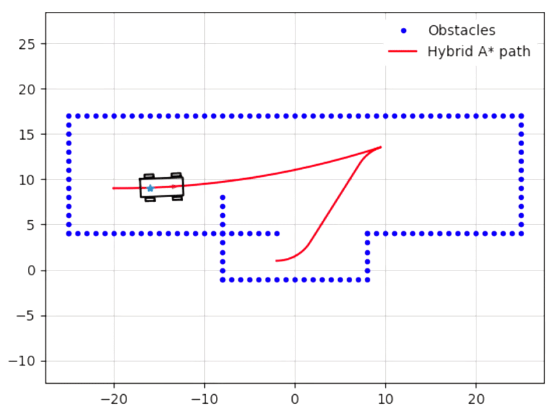

Robotic Algorithms
========
Implement some robotic algorithms with python

### Requirement
Install dependencies from the `requirements.txt` using:
```
pip install -r requirements.txt
```

## Particle Filter
[Particle filter](./algorithms/particle_filter.py) for localization with known correspondences

#### Demo
<p align="left">
  
</p>


## Hybrid A-Star for Path Planning
[Hybrid A-Star](./algorithms/hybrid_a_star) for path planning with Reeds-Shepp curves

#### Demo
<p align="left">
  
</p>